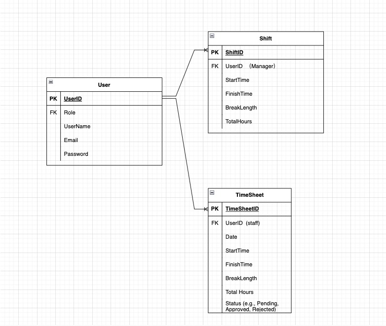
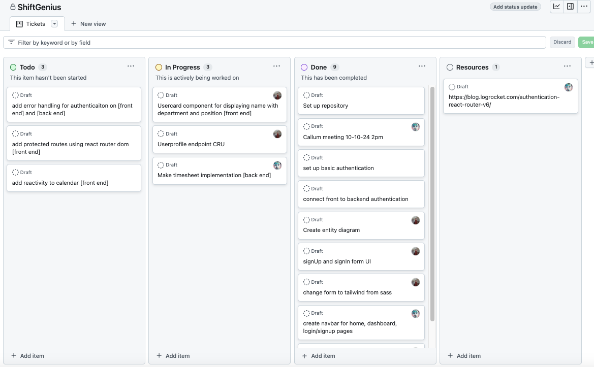

# ShiftGenius

An app for scheduling shifts inspired by Deputy.
Built in ReactTS and Spring boot, and TailwindCSS.
Built by Jenny and Chapman.

# ERD

# Tech Stack

<!--  -->

 

 

 

 

 

 

 
 

# Agile method

# Changelog

Team member : Chapman, Jenny

- 10-10-24:
  - Discuss features for MVP.
  - Database schema
  - Set up ticketing board for project management.
  - Set up GitHub repo
  - Set up boilerplate for front and backend.
- 14-10-24
  - Pair programming to add authentication to backend and Login/Signup pages to frontend.
- 15-10-24
  - Add tailwind css to Login/Signup pages to frontend, update readme.md
- 17-10-24
  - Discuss main feature and UI. Assign tickets
  - Add profile endpoint CRU operations.
  - Add profile form UI on Frontend,update readme.md
- 19-10-24 & 20-10-24
  - add profile fronted connect to backend successfully
  - Create Ui for calendar,
  - Create navBar
  - Create Shift form, to submit shifts
  - create endpoints for shifts/timeSheets
  - debug cors issue
- 21-10-24

  - update navBar with Me component slideshow profile info
  - user basic info implement on dashboard

- 22-10-24

  - Make calendar ui dynamic, gets dates via JS date method
  - Make buttons clickable to rotate through dates on front end
  - adds shift button to show/unshow shift form to add shifts.
  - adds logic to retrieve shifts and add to calendar object

- 22-10-24
  - chapman update???
- 24-10-24
- Update localStorage to ensure the user data don't get lost when page get freshed
- set up authentication and authorization for user to access certain pages or features.
- update the app logo

# Todo

- addshift- can select user with dropdown (populates data)
- role attach to JWT so we know what role the user is.